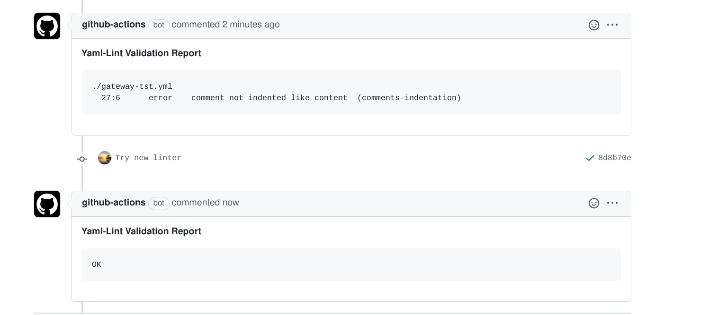
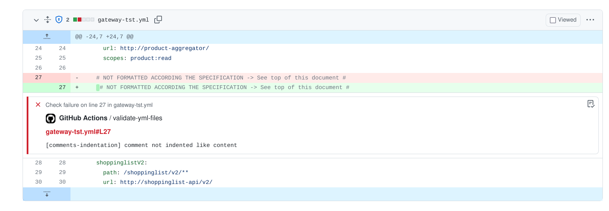

# yamllint-action

To prevent each build from building a yamllint container over-and-over-again,
this action will use a hosted prebuilt container.

## Usage

Create a file .github/workflows/validate-yml.yml, with following content:

```yaml
name: Verify - Yaml Lint

# This verifies all YML files in your project automatically when a
# PR is created or updated. You can also trigger the validation step manually.
#
# The used YAML-LINT module is a slightly altered version of the more known version of it. In this
# version, the module does output in a format which will annotate the github files in your "files"
# tab (same as the normal version), but as extra, this module will write a text summary into an
# environment variable.
#
# We use this environment variable to write as PR comment, so that the user will clearly see that
# there is an issue to solve, and what the issue is. It also shows a link to the files section
# of the PR.
#
# As it makes no sense to keep multiple validation reports in the comment section, I have added
# some code in this action which searches for old valdation comments, and deletes them before adding
# the latest comment.
#
# There are multiple ways of writing comments. In this one I used a plain "curl" statement to talk
# to the GitHub API, but there are also other modules you can use (like tactions/github-script).
#
# Note: the pull-request comment will ONLY be shown when the validation is triggered by a PR change.
# For a manual run, the script does not know where to comment, so in that case the results are
# only shown in the action run log.

# Allow to trigger both on pull-request updates, and on manual start.
on:
  workflow_dispatch:
  pull_request:
    branches:
      - master
      - main

# Cancel any previous pending builds on this PR (in case some quick commits are done after each other).
concurrency:
  group: ${{ github.workflow }}-${{ github.ref }}
  cancel-in-progress: true

jobs:
  validate-yml-files:
    runs-on: ubuntu-latest
    steps:
      - name: Checkout
        uses: actions/checkout@v2

      - run: |
          echo github.event.number = ${{ github.event.number  }}
          echo github.event.pull_request.number = ${{ github.event.pull_request.number }}
          echo github.event.issue.number = ${{ github.event.issue.number }}
          echo URL "${{ github.event.pull_request._links.html.href }}/files"
          echo "${{ toJSON(github.event) }}"
          
      # See also https://github.com/atkaper/yamllint-action for the tweaked yamllint module.
      - name: Run yamllint
        uses: atkaper/yamllint-action@2.3.0

      - name: Delete old yamllint pull request comment(s)
        env:
          URL: ${{ github.event.pull_request.comments_url }}
          TOKEN: ${{ secrets.GITHUB_TOKEN }}
        if: ${{ (success() || failure()) && (github.event.pull_request.number) }}
        run: |
          # Check first 100 comments, find ones which start with "#### Yaml", and get their url's.
          # Note/Warning: simplification/limitation - we do not look past the first 100 comments. So for larger amounts this needs a paging fix.
          curl -s -H "Accept: application/vnd.github.v3+json" "${URL}?per_page=100&page=1" -H "Authorization: token $TOKEN" >comments.json
          DELETE_URLS="$( jq -r ".[] | select(.body | startswith(\"#### Yaml\")) | .url" comments.json )"
          for U in ${DELETE_URLS}; do curl -s -X DELETE -H "Accept: application/vnd.github.v3+json" "$U" -H "Authorization: token $TOKEN"; done

      - name: Write yamllint output as pull request comment
        env:
          URL: ${{ github.event.pull_request.comments_url }}
          TOKEN: ${{ secrets.GITHUB_TOKEN }}
          LINT: ${{ env.YAML_LINT_OUT }}
        if: ${{ (success() || failure()) && (github.event.pull_request.number) }}
        run: |
          jq -cRs '{ body: (.|sub("\\s+$";"")) }' <<SHERE >body.json
          #### Yaml-Lint Validation Report:

          ${LINT:-OK}

          ${LINT:+See also ${{ github.event.pull_request._links.html.href }}/files}
          SHERE
          curl -s "$URL" -H "Content-Type: application/json" -H "Authorization: token $TOKEN" -d @body.json
```

Make sure you create a .yamllint config file in the root of your project with settings as needed. You can copy the example from
this project's root.

This version will put the yamllint output also in an environment variable called YAML_LINT_OUT for further use in next action steps.
You can use it in a next step using: ${{ env.YAML_LINT_OUT }}
In above example it writes the status as PR conversation comment.

## Example Screenshots






## Forked from

https://github.com/koozz/yamllint-action

## License

MIT
